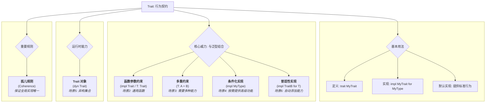

### **核心思想：Trait 是“行为契约”**

您可以将 Trait 理解为一份**契约**或**能力认证**。它定义了一组方法，任何类型只要实现了这个 Trait，就等于签署了这份契约，并向编译器保证“我具备了这些方法所描述的行为”。

这使得我们可以编写不关心具体类型、只关心“行为”的通用代码，是 Rust 实现抽象和代码复用的基石。

---

### **Trait 功能特性与应用场景**

下面我们将通过一系列场景来解释 Trait 的各项特性。

#### **场景 1：需要定义一种通用的、可共享的行为**

- **功能**：**定义 Trait** 和 **实现 Trait**。
- **何时使用**：当你的程序中有多个不同的结构体，但它们在概念上都应具备某种相同能力时。
- **例子**：假设你在开发一个游戏，游戏里有多种单位（`Player`, `Monster`, `NPC`），它们的数据结构不同，但都应该有“报告自己当前位置”的能力。
  Rust
  ```rust
  // 1. 定义一个“可定位”的契约
  trait Positionable {
      fn get_position(&self) -> (i32, i32);
  }

  // 定义具体类型
  struct Player { name: String, x: i32, y: i32 }
  struct Monster { monster_type: String, x: i32, y: i32 }

  // 2. 为 Player 履行契约
  impl Positionable for Player {
      fn get_position(&self) -> (i32, i32) {
          (self.x, self.y)
      }
  }

  // 3. 为 Monster 履行契约
  impl Positionable for Monster {
      fn get_position(&self) -> (i32, i32) {
          (self.x, self.y)
      }
  }
  ```
  现在，`Player` 和 `Monster` 都被认证为 `Positionable`。

#### **场景 2：编写一个能处理所有“可定位”单位的通用函数**

- **功能**：**Trait Bound (作为函数参数)**，使用 `impl Trait` 或 `<T: Trait>`。
- **何时使用**：当你希望编写一个函数，它能接受多种不同类型的参数，只要这些参数都满足某个行为契约。
- **例子**：写一个函数 `print_distance`，计算任何两个“可定位”单位之间的距离。
  ```rust
  // 使用 impl Trait 语法，简洁直观
  fn print_distance(a: &impl Positionable, b: &impl Positionable) {
      let pos_a = a.get_position();
      let pos_b = b.get_position();
      let distance = ((pos_a.0 - pos_b.0).pow(2) + (pos_a.1 - pos_b.1).pow(2)) as f64;
      println!("Distance: {:.2}", distance.sqrt());
  }

  fn main() {
      let player = Player { name: "Alice".into(), x: 0, y: 0 };
      let monster = Monster { monster_type: "Goblin".into(), x: 3, y: 4 };

      // 这个函数可以同时接受 Player 和 Monster，因为它们都实现了 Positionable
      print_distance(&player, &monster); // 输出: Distance: 5.00
  }
  ```

#### **场景 3：一个通用函数需要它的参数同时具备多种能力**

- **功能**：**通过 `+` 指定多个 Trait Bound**。
- **何时使用**：当函数逻辑需要参数既能做 A 行为，又能做 B 行为时。
- **例子**：我们要写一个函数 `log_and_locate`，它既要**打印**单位的详细信息（需要 `std::fmt::Display` Trait），又要**获取**它的位置（需要 `Positionable` Trait）。
  ```rust
  use std::fmt::Display;

  // T 必须同时实现 Positionable 和 Display 两个 Trait
  fn log_and_locate<T: Positionable + Display>(item: &T) {
      // 因为有 Display 约束，所以可以用 {} 打印
      println!("Logging item: {}", item);
      // 因为有 Positionable 约束，所以可以调用 .get_position()
      let pos = item.get_position();
      println!("Item located at: ({}, {})", pos.0, pos.1);
  }

  // 为了让 Player 能被这个函数使用，我们必须为它实现 Display
  impl Display for Player {
      fn fmt(&self, f: &mut std::fmt::Formatter<'_>) -> std::fmt::Result {
          write!(f, "Player({})", self.name)
      }
  }

  fn main() {
      let player = Player { name: "Alice".into(), x: 10, y: 20 };
      log_and_locate(&player);
  }
  ```

#### **场景 4：为一个泛型结构体提供只有在特定条件下才存在的“高级功能”**

- **功能**：**使用 Trait Bound 有条件地实现方法**。
- **何时使用**：当你有一个泛型容器（如 `Pair<T>`），并希望它的一些方法仅在内部类型 `T` 具备某些能力（如可比较、可相加）时才可用。
- **例子**：创建一个 `Pair<T>` 结构体，它总是可以被创建，但只有当 `T` 可比较时，才提供一个 `compare` 方法。
  ```rust
  struct Pair<T> {
      a: T,
      b: T,
  }

  // 这个 impl 块对任何 T 都有效
  impl<T> Pair<T> {
      fn new(a: T, b: T) -> Self {
          Self { a, b }
      }
  }

  // 这个 impl 块只在 T 实现了 PartialOrd (可比较) 时才有效
  impl<T: PartialOrd> Pair<T> {
      // 这个方法只有在 T 支持 <, > 等操作时才存在
      fn compare(&self) {
          if self.a > self.b {
              println!("a is greater");
          } else if self.b > self.a {
              println!("b is greater");
          } else {
              println!("a and b are equal");
          }
      }
  }

  fn main() {
      let num_pair = Pair::new(5, 10);
      num_pair.compare(); // OK! i32 可比较

      struct NoCompare;
      let struct_pair = Pair::new(NoCompare, NoCompare);
      // struct_pair.compare(); // 编译错误！NoCompare 没有实现 PartialOrd
  }
  ```

#### **场景 5：想在一个列表中存放不同类型的游戏单位，并统一处理**

- **功能**：**Trait 对象 (Trait Objects)**，使用 `dyn Trait`。
- **何时使用**：当你需要**运行时**的多态性，即在一个集合中存储不同具体类型的实例，只要它们都实现了同一个 Trait。
- **例子**：创建一个 `Vec`，里面既有 `Player` 也有 `Monster`，然后遍历它们获取位置。
  ```rust
  fn main() {
      let player = Player { name: "Alice".into(), x: 0, y: 0 };
      let monster = Monster { monster_type: "Goblin".into(), x: 3, y: 4 };

      // 这个 Vec 的类型是 Box<dyn Positionable>，可以持有任何实现了 Positionable 的类型
      let game_units: Vec<Box<dyn Positionable>> = vec![
          Box::new(player),
          Box::new(monster),
      ];

      for unit in game_units {
          // 我们不关心 unit 的具体类型，只知道它一定有 .get_position() 方法
          let pos = unit.get_position();
          println!("Found a unit at {:?}", pos);
      }
  }
  ```

#### **场景 6：为所有能被打印的类型，自动提供一个转换为字符串的功能**

- **功能**：**Blanket Implementations (普适性实现)**。
- **何时使用**：当你希望为所有满足某个 Trait 的类型，自动实现另一个 Trait。
- **例子**：标准库中最经典的例子就是为所有实现了 `Display` 的类型自动实现 `ToString`。
  ```rust
  // 这是标准库中的实现（简化版）
  // 为任何实现了 Display 的类型 T，实现 ToString Trait
  impl<T: Display> ToString for T {
      fn to_string(&self) -> String {
          // ... 它的实现就是调用 Display 的功能 ...
          self.to_string()
      }
  }

  // 因为 i32 实现了 Display，所以我们可以直接调用 .to_string()
  let number_string = 5.to_string(); // "5"
  // 因为 Player 实现了 Display，所以我们也可以调用 .to_string()
  let player = Player { name: "Alice".into(), x: 0, y: 0 };
  let player_string = player.to_string(); // "Player(Alice)"
  ```

### **知识点总结图**

代码段


