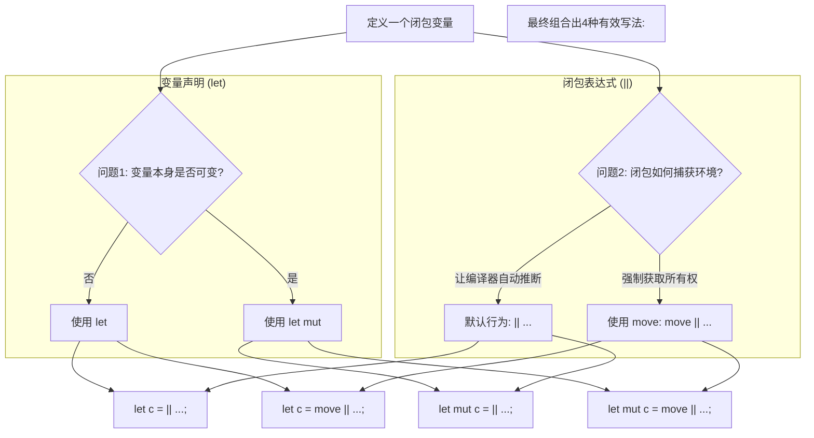

```mermaid
graph TD
    A[定义一个闭包变量] --> B{问题1: 变量本身是否可变?};
    A --> C{问题2: 闭包如何捕获环境?};

    subgraph "变量声明 (let)"
        B -- "否" --> D[使用 let];
        B -- "是" --> E[使用 let mut];
    end

    subgraph "闭包表达式 (||)"
        C -- "让编译器自动推断" --> F["默认行为: || ..."];
        C -- "强制获取所有权" --> G["使用 move: move || ..."];
    end

    sub-A["最终组合出4种有效写法:"]
    H1["let c = || ...;"]
    H2["let mut c = || ...;"]
    H3["let c = move || ...;"]
    H4["let mut c = move || ...;"]

    D & F --> H1;
    E & F --> H2;
    D & G --> H3;
    E & G --> H4;
```