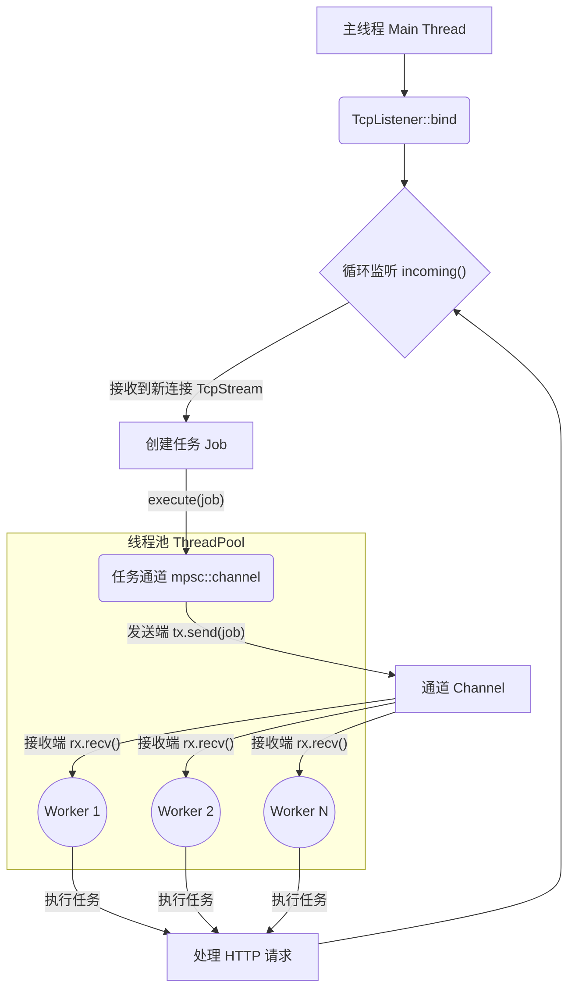

```mermaid
graph TD
    A[主线程 Main Thread] --> B(TcpListener::bind);
    B --> C{"循环监听 incoming()"};
    C -- 接收到新连接 TcpStream --> D[创建任务 Job];
    subgraph 线程池 ThreadPool
        direction LR
        E(任务通道 mpsc::channel)
        F((Worker 1));
        G((Worker 2));
        H((Worker N));
    end
    D -- execute(job) --> E;
    E -- 发送端 tx.send(job) --> I[通道 Channel];
    I -- 接收端 rx.recv() --> F;
    I -- 接收端 rx.recv() --> G;
    I -- 接收端 rx.recv() --> H;
    F -- 执行任务 --> J[处理 HTTP 请求];
    G -- 执行任务 --> J;
    H -- 执行任务 --> J;
    J --> C;
```