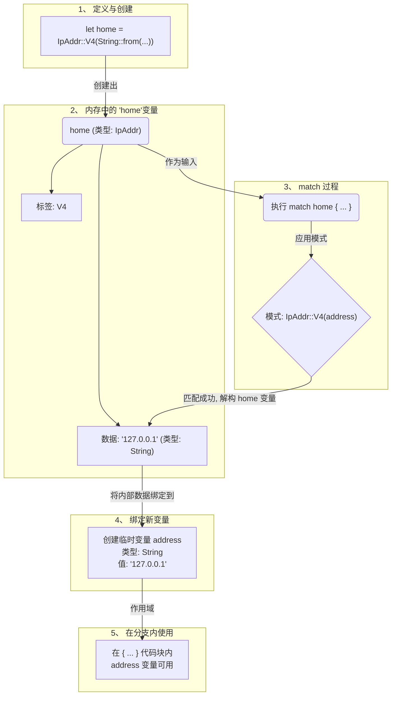

### 现有的问题

在我们做出转变**之前**，我们有两个数据结构来表示一个 IP 地址：

1. 一个简单的枚举 `IpAddrKind`，它只像一个**标签**，告诉你类型是 V4 还是 V6。
2. 一个结构体 `IpAddr`，它像一个**容器**，把“标签”和实际的数据（地址字符串）硬凑在一起。

```rust
// 标签
enum IpAddrKind {
    V4,
    V6,
}

// 容器
struct IpAddr {
    kind: IpAddrKind, // 标签放在这里
    address: String,  // 数据放在这里
}
```

**问题在于**：`kind` 和 `address` 这两个信息是强相关的，一个 V4 的 `kind` 必须对应一个 V4 格式的 `address`。但在这个结构中，它们是两个独立的字段。虽然我们手动把它们放在了一起，但这种关联并不是结构本身强制的，显得有些“松散”和“笨拙”。感觉就像你有一个名牌，上面写着“学生”，然后你另外再拿一张纸写上你的名字，而不是直接拥有一张信息完整的学生证。

### 目的是什么？

我们的核心目的有两个：

1. **更紧凑地建模**：我们想用**一个单一、统一的类型**来表示“一个 IP 地址”。这个类型应该天生就知道自己是 V4 还是 V6，并且**自带**相应的地址数据。
2. **提升类型安全**：让数据结构本身就能保证“V4 类型”和“V4 的数据”是不可分割的整体。消除“标签”和“数据”分离的松散状态。

简单来说，目标就是把“名牌”和“写着名字的纸”合二为一，变成一张信息完整的“身份证”。这张身份证的类型（比如是`V4`版还是`V6`版）和它上面的信息（地址字符串）是天生一体的。

### 实现思路

实现这个目标的思路，就是对 `enum` 的一次思想升级：

> **不要把枚举的变体（variant）看作简单的标签，而是把它看作可以携带数据的容器。**

- 原来的 `V4` 只是一个孤零零的符号。
- 新的思路是，让 `V4` 这个变体本身，像一个元组结构体（Tuple Struct）一样，可以包含一个 `String` 类型的值。我们把它写成 `V4(String)`。

这就意味着，`IpAddr` 这个枚举类型，它的值要么是 `V4` **并且**包裹着一个 `String`，要么是 `V6` **并且**包裹着一个 `String`。`V4` 和 `String` 的关系，从之前在外部由 `struct` 撮合，变成了现在在 `enum` 内部的**原生绑定**。

### 使用方法

这个思想上的转变，直接导致了使用方式的变化。

- **以前**：要创建一个 IP 地址，你需要先创建各个部分，然后像组装零件一样把它们塞进 `struct` 里。
  ```rust
  let home = IpAddr {
      kind: IpAddrKind::V4, // 零件1
      address: String::from("127.0.0.1"), // 零件2
  };
  ```
- **现在**：枚举的变体 `IpAddr::V4` 表现得像一个**构造函数**。你直接调用它，并把数据作为参数传进去，一步到位生成一个完整的 `IpAddr` 实例。
  ```rust
  enum IpAddr {
    V4(String),
    V6(String),
  }
  let home = IpAddr::V4(String::from("127.0.0.1")); // 一步到位
  ```
  这个调用直接返回一个 `IpAddr` 类型的值，这个值是 `V4` 变体，且内部已经包含了那个 `String`。

### 函数的实现

假设我们要写一个打印 IP 地址的函数，前后对比也很明显。

- **转变前**：函数接收一个 `struct`，然后分别访问它的字段。

  ```rust
  // 函数接收一个 struct
  fn print_ip(ip: IpAddr) {
      // 直接访问字段
      println!("Type: {:?}, Address: {}", ip.kind, ip.address);
  }
  ```

- **转变后**：函数接收一个 `enum`。你不能直接访问 `address`，因为 `IpAddr` 本身没有 `address` 字段。你需要使用 `match` **模式匹配**来安全地处理每一种变体，并从中提取数据。
  ```rust
  // 1. 定义我们带数据的枚举
  enum IpAddr {
  V4(String),
  V6(String),
  }

// 2. 定义那个使用 match 的函数
fn print_ip(ip: IpAddr) {
println!("--- 开始检查一个 IP 地址 ---");
match ip {
IpAddr::V4(address) => {
// 如果 ip 是 V4，address 变量在这里被创建并赋值
println!("这是一个 IPv4 地址，它的值是: {}", address);
},
IpAddr::V6(address) => {
// 如果 ip 是 V6，address 变量在这里被创建并赋值
println!("这是一个 IPv6 地址，它的值是: {}", address);
},
}
println!("--- 检查结束 ---\n");
}

// 3. 在 main 函数中创建实例并调用函数
fn main() {
// 创建一个 V4 变体的实例
let home = IpAddr::V4(String::from("127.0.0.1"));

    // 创建一个 V6 变体的实例
    let loopback = IpAddr::V6(String::from("::1"));

    // 把它们分别传给函数，看看 match 如何工作
    print_ip(home);
    print_ip(loopback);

}
```


