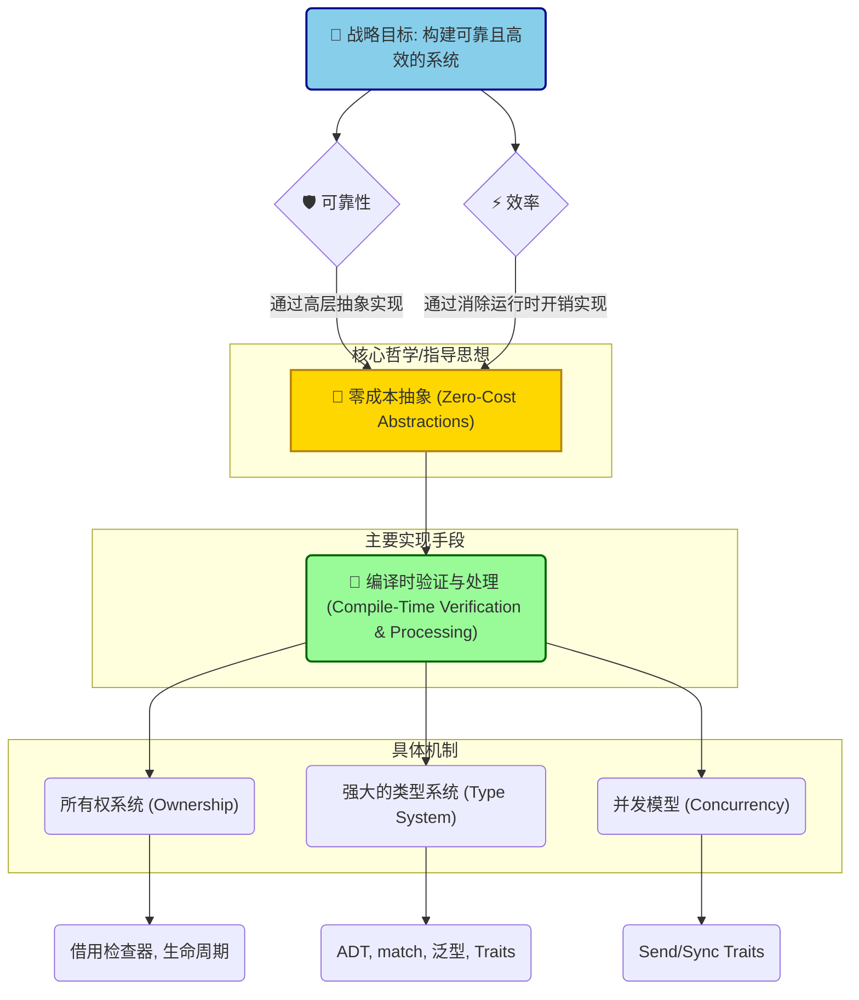

```mermaid
graph TD
    A("🚀 战略目标: 构建可靠且高效的系统") --> B{"🛡️ 可靠性"} & C{"⚡ 效率"};

    subgraph "核心哲学/指导思想"
        Z["🌟 零成本抽象 (Zero-Cost Abstractions)"];
    end

    B -- "通过高层抽象实现" --> Z;
    C -- "通过消除运行时开销实现" --> Z;

    subgraph "主要实现手段"
        D("🧠 编译时验证与处理 (Compile-Time Verification & Processing)");
    end

    Z --> D;

    subgraph "具体机制"
        D --> E("所有权系统 (Ownership)");
        D --> F("强大的类型系统 (Type System)");
        D --> G("并发模型 (Concurrency)");
    end

    E --> E1("借用检查器, 生命周期");
    F --> F1("ADT, match, 泛型, Traits");
    G --> G1("Send/Sync Traits");

    style A fill:#87CEEB,stroke:#00008B,stroke-width:2px
    style Z fill:#FFD700,stroke:#B8860B,stroke-width:2px
    style D fill:#98FB98,stroke:#006400,stroke-width:2px
```
